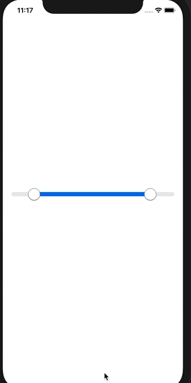

# RangeSlider

A basic demo application with helper classes to make a Range Slider intead of the normal ``Slider`` component provided in iOS

### Demo

#### TODO
* Add Gif to the ReadMe
* Make a pod out of these classes
